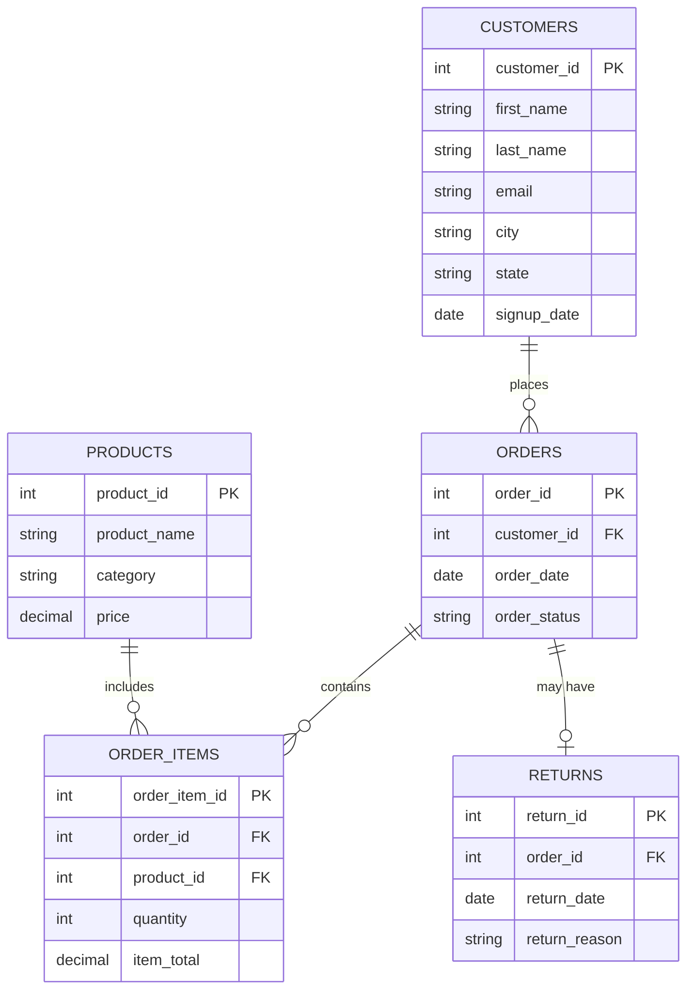

  

<h1 align="center">🛒 Ecommerce SQL Analytics Project</h1>

  A complete end-to-end SQL project including database schema design, CSV ingestion, analytical queries, predictive modeling, and reporting.

  <!-- Tech Stack -->
  
  
  
  

  <!-- Project Status -->
  

  <!-- License -->
  

# E-Commerce Customer Insights & Predictive Modeling (SQL Project)
## A complete SQL analytics project featuring data modeling, business insights, and predictive analysis.

# Project Overview

Using SQL (MySQL 5.5), the project demonstrates:

    Data modeling & relational database design

    Exploratory analysis & business performance metrics

    Customer behavioral analytics

    Feature engineering

    Predictive scoring using SQL

    Revenue forecasting using linear regression

# Business Scenario

## An e-commerce retailer wants to:

    Understand customer purchasing behavior

    Identify customers at risk of churning

    Predict future revenue

    Rank customers based on their likelihood to purchase again

## You were asked as the Data Analyst to:

    Build a clean relational schema

    Ingest raw CSV data

    Produce insights using SQL

    Develop predictive SQL models

# Dataset Description

The dataset consists of 10 customers, 10 products, 10 orders, 10 order items, and 2 returns. Although small, it represents a realistic relational structure used in commerce.

Tables included:

## Customers Table

## Products Table

## Order_Items Table

## Orders Table

## Returns Table

# Tech Stack

    MySQL 5.5

    SQL feature engineering

    Temporary tables

    Subqueries

    Regression math (slope/intercept)

    Codio development environment

# Database Schema

## ERD

# Analysis & Predictive Models

## This project includes three major analytic components, all written in SQL and fully compatible with MySQL 5.5.

  1.0 Purchase Likelihood Scoring

    With 4 features:

      purchase_count

      total_spent

      days_since_purchase

      A weighted likelihood_score

  1.1 Formula:

    likelihood_score = purchase_count * 0.4 + total_spent * 0.005- days_since_purchase * 0.02

  1.2 Purpose:

    Prioritize customers for email, SMS, and retargeting campaigns.

  1.3 Example Output:

  2.0 Churn Risk Model

  Customers are categorized into:

    High Risk

    Medium Risk

    Low Risk

  Based on:

    Days since last purchase

    Total revenue

    Order history

  2.1 CASE  
  
    WHEN days_since_last_purchase > 90 THEN 'High Risk'
  
    WHEN days_since_last_purchase BETWEEN 31 AND 90 THEN 'Medium Risk'
  
    ELSE 'Low Risk'
  
    END

  2.2 Example Output:

  3.0 Revenue Forecasting Using SQL Regression

    A full linear regression model was built using:

      Temporary tables

      Summation statistics

      Slope/intercept calculations

      Time indexing (t)

    Outputs include:

      Past revenue

      Predicted future revenue trend

  3.1 Example Output

# How to Run This Project (Step-by-Step)

1. Clone the repository
   
      git clone https://github.com/yourusername/ecommerce_sql_project.git

      cd ecommerce_sql_project

2. Open MySQL
   
      mysql --local-infile=1 -u root

3. Create the database & schema
   
      SOURCE schema.sql;

4. Load the CSV data
   
      LOAD DATA LOCAL INFILE 'customers.csv' INTO TABLE customers ...;

      (Full commands included in project.)

5. Run all analysis & predictive models
   
      SOURCE analysis_queries.sql;

# Skills Demonstrated
## SQL Skills

    JOINs, GROUP BY, ORDER BY

    Subqueries

    Temporary tables

    Aggregate math

    Feature engineering

    Regression modeling

    Churn prediction logic

    Analytics Skills

    Cohort-style behavior analysis

    Lifecycle modeling

    Customer segmentation

    Revenue forecasting

    Data storytelling

    Business Skills

    Understanding of customer lifecycle

    Retention analysis

    Revenue intelligence

    KPI-driven analytics

# 📄 License

This project is licensed under the **MIT License**.  
You are free to use, modify, and distribute this project, provided proper credit is given.

